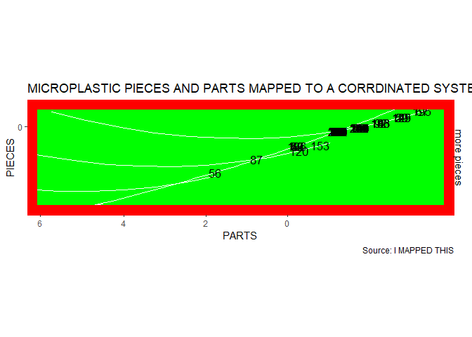
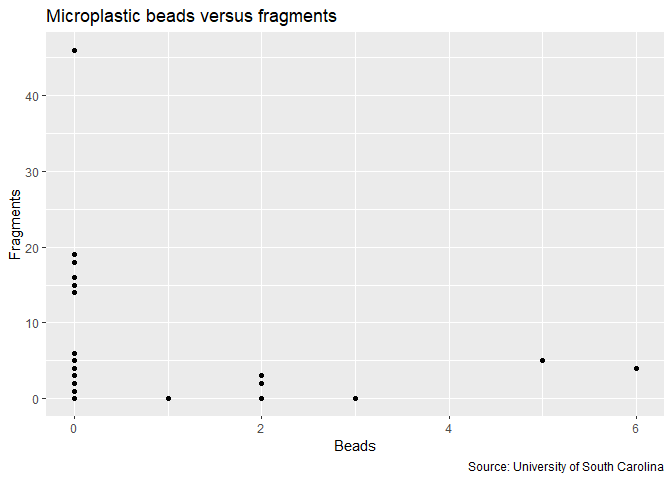

Badplot
================

Here is my example of a very bad plot. First, there is nearly zero
context on what we are actually looking at (Tufte 74). Second, because
it contains an excessive amount of ink in the form of the red border and
labels (Tufte p 93). The graphical integrity of this chart is severely
compromised because of the mislabeling of the data points which creates
an illusion of a 100+ points. In reality there are less than 20 points
(Tufte p 87). The design of this plot is very confusing and leads you
wondering why do we not have separated charts for each of the data that
is trying to be shown (Tufte 137)? There is also a scale problem where
it is actually reversed and doesnt begin at 0 (Sylor 2020).

``` r
library(ggplot2)

Micro <-read.csv("Bridge.csv")


ggplot(Micro,aes(Microbeads,Fragments))+ 
  coord_map(projection = "ortho", orientation=c(-63,-800, -999)) + 
  labs(title="MICROPLASTIC PIECES AND PARTS MAPPED TO A CORRDINATED SYSTEM SO YOU CAN SEE WHERE THE STUFF IS ACTUALLY At", y="PIECES", x="PARTS", caption="Source: I MAPPED THIS") +
  theme(panel.background = element_rect(fill = 'green', colour = 'Yellow')) +
  scale_color_manual(values=c("red", "red")) +
  geom_text(aes(label = rownames(Micro)),
            size = 4.5) +
  theme(panel.border = element_rect(color = "red",
                                    fill = NA,
                                    size = 10)) +
  scale_y_continuous(sec.axis = sec_axis(~ . + 10, name= "more pieces"))
```

<!-- --> \# Good plot

Restructured and redisgned to be minimal. Also separated the data points
so it isnt as clunky and removed the coordinate systems.

``` r
ggplot(Micro,aes(Microbeads,Fragments)) + geom_point() +labs(title="Microplastic beads versus fragments", y="Fragments", x="Beads", caption="Source: University of South Carolina")
```

<!-- -->
