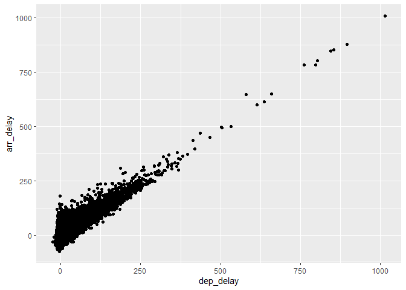

Homework 4
================

``` r
#running the tests
a <- 3
b <- 2
print(a+b)
```

    ## [1] 5

``` r
sum(a+b)
```

    ## [1] 5

``` r
#loading in the packages
library(nycflights13)
library(tidyverse)


#filtering by flights containing carrier "AA"
AA_flights <- filter(flights, carrier == "AA")

#plotting departure delay versus arrival delay
ggplot(data=AA_flights, mapping = aes(x=dep_delay, y=arr_delay))+geom_point() 
```

<!-- -->
