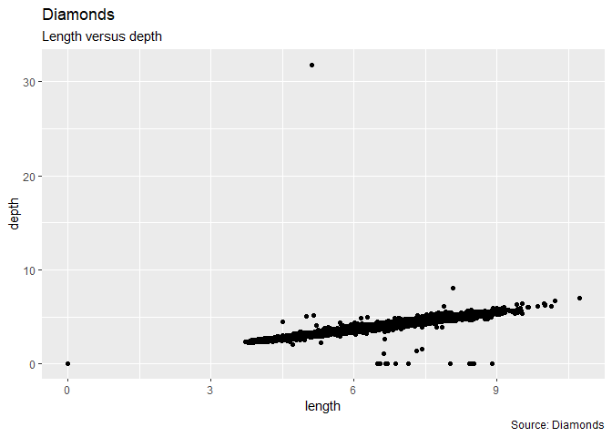

R Notebook
================

``` r
library(tidyverse)
library(dplyr)
view(diamonds)
#question 1
diamonds %>% 
  group_by(cut) %>%
  summarise(counts = n())
```

    ## # A tibble: 5 x 2
    ##   cut       counts
    ##   <ord>      <int>
    ## 1 Fair        1610
    ## 2 Good        4906
    ## 3 Very Good  12082
    ## 4 Premium    13791
    ## 5 Ideal      21551

``` r
#question 2
datapercent<-sample_frac(diamonds,0.01)

#question 3
Diamonds1 <-diamonds %>%
  group_by(clarity) %>%
  slice_max(order_by=carat,n=100, with_ties=FALSE)%>%
  summarise(mean_size=mean(carat))
  
  

#question 4
ggplot(data = diamonds, mapping = aes(x = x, y = y)) + geom_point()+labs(title="Diamonds", 
       subtitle="Length versus width",
       caption="Source: Diamonds",
       x="length",
       y="Width")
```

<!-- -->

``` r
avg_size_filt <- filter(diamonds, z >2)
ggplot(data = diamonds, mapping = aes(x = x, y = z)) + geom_point()+labs(title="Diamonds", 
       subtitle="Length versus depth",
       caption="Source: Diamonds",
       x="length",
       y="depth")  
```

<!-- -->
