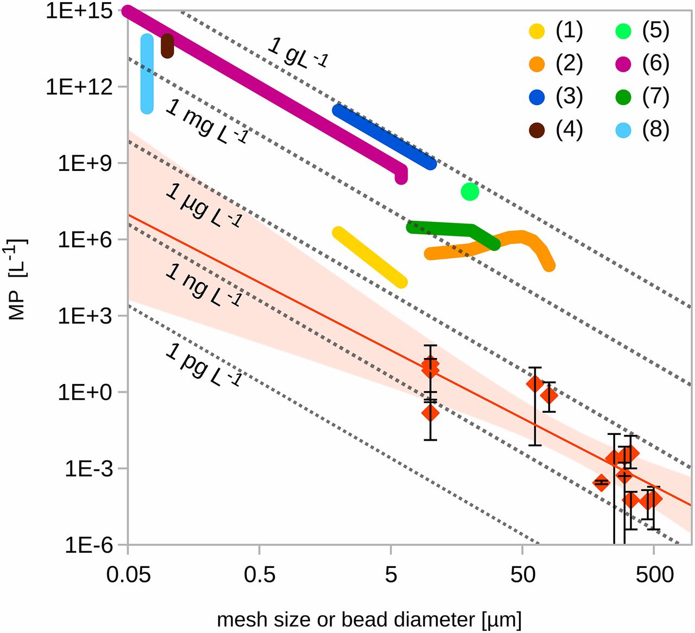
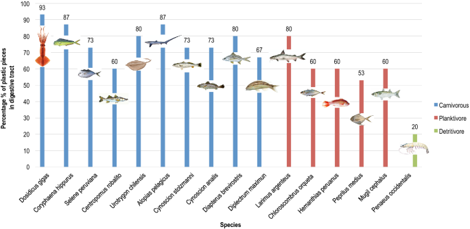

# Bad Plot


```{r}


```

Published in the Economist

The data named "Mp" is mapped to the Y axis. 

The data named "Mesh size or bead diameter [um]" is mapped to the x axis and to the colored lines and orange diamonds.

The data is displayed using geom(point), geom(line) and geom(label).

Data is categorical and ordered.

# Evaluation of the bad plot
Tons of ink

Data points are unclear

Error bars extend below the axis

The two concentrations between the average and observed use two different arbitrary styles (diamonds vs lines)

## Ways to fix 

Changing error bars to a different style such as eyes

Changing chart type (scatterplot?) (double axis?)

Getting rid of extra ink and clean up areas where its outside  the boundary


# Good Plot


```{r}

```

Published in Nature
The data named "Percentage % of plastic species in digestive tract" is mapped to the Y axis. 

The data named "species" is mapped to the X axis with colors ,numbers and  and pictures of the fish type.

The data is displayed using geom(bar) and geom(col).

Data is categorical and non-ordered.

Bars are scaled appropriately to each one and non-distorted, boxes around the plot are gone and columns are small
Contrasting colors

Labels rotated making it easier to read (even though Wilkes doesnt like this, could be changed to horizontal)

Legend to show what the colors mean


