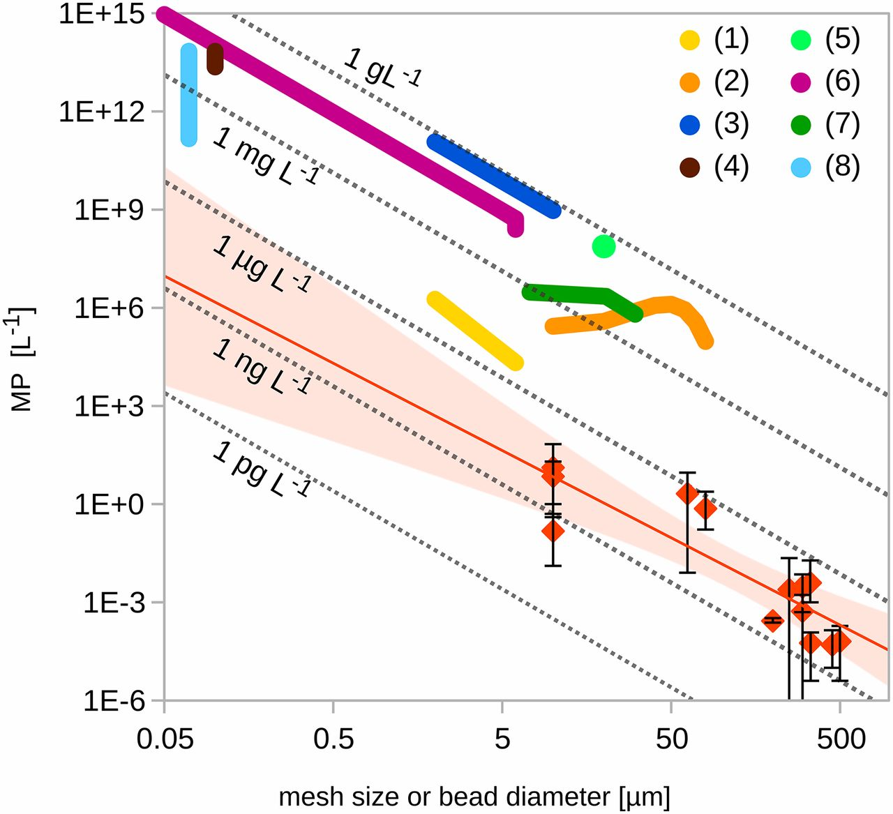
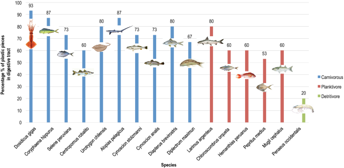

Homework 6
================

# Bad Plot

``` r

```

<!-- -->

Published in the Economist

The data named “Mp” is mapped to the Y axis.

The data named “Mesh size or bead diameter \[um\]” is mapped to the x
axis and to the colored lines and orange diamonds.

The data is displayed using geom(point), geom(line) and geom(label).

Data is categorical and ordered.

# Evaluation of the bad plot

Tons of ink

Data points are unclear

Error bars extend below the axis

## Ways to fix

Changing error bars to a different style such as eyes

Changing chart type (scatterplot?) (double axis?)

Getting rid of extra ink and clean up areas where its outside the
boundary

# Good Plot

``` r

```

<!-- -->

Published in Nature The data named “Percentage % of plastic species in
digestive tract” is mapped to the Y axis.

The data named “species” is mapped to the X axis with colors ,numbers
and and pictures of the fish type.

The data is displayed using geom(bar) and geom(col).

Data is categorical and non-ordered.

Bars are scaled appropriately to each one and non-distorted, boxes
around the plot are gone and columns are small Contrasting colors

Labels rotated making it easier to read (even though Wilkes doesnt like
this, could be changed to horizontal)

Legend to show what the colors mean
