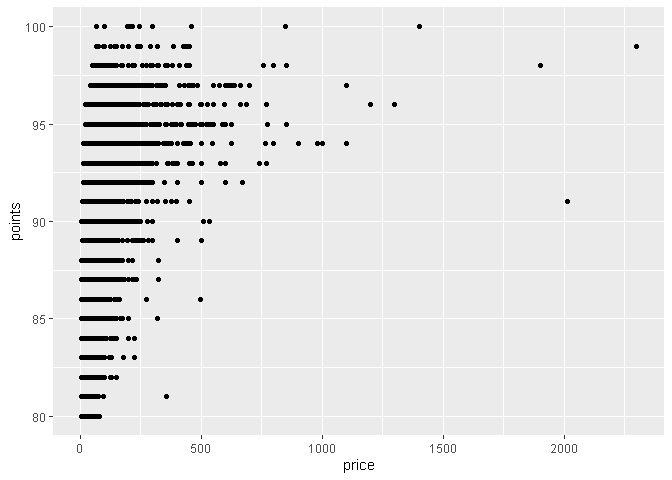

Homework 3
================

Today I wanted to investigate if the price of wine indicated higher
quality by points. Utilizing the system below a plot was created to
investigate price versus points. This plot indicates that price is not
the sole factor in points in wine as high quality (&gt;90) points are
shown across a variety of price ranges. Further, the highest price
points actually indicate lower quality wines.

95-100 Classic: a great wine. 90-94 Outstanding: a wine of superior
character and style. 85-89 Very good: a wine with special qualities.
80-84 Good: a solid, well-made wine. 75-79 Mediocre: a drinkable wine
that may have minor flaws. 50-74 Not recommended.

``` r
library(tidyverse)
```

    ## -- Attaching packages --------------------------------------- tidyverse 1.3.1 --

    ## v ggplot2 3.3.5     v purrr   0.3.4
    ## v tibble  3.1.4     v dplyr   1.0.7
    ## v tidyr   1.1.3     v stringr 1.4.0
    ## v readr   2.0.1     v forcats 0.5.1

    ## -- Conflicts ------------------------------------------ tidyverse_conflicts() --
    ## x dplyr::filter() masks stats::filter()
    ## x dplyr::lag()    masks stats::lag()

``` r
Wine<-read.csv("winemag-data_first150k.csv")
price <- (Wine$price)
points <- (Wine$points)
ggplot(data = Wine, mapping = aes(x = price, y = points)) + geom_point()
```

    ## Warning: Removed 13695 rows containing missing values (geom_point).

<!-- -->
