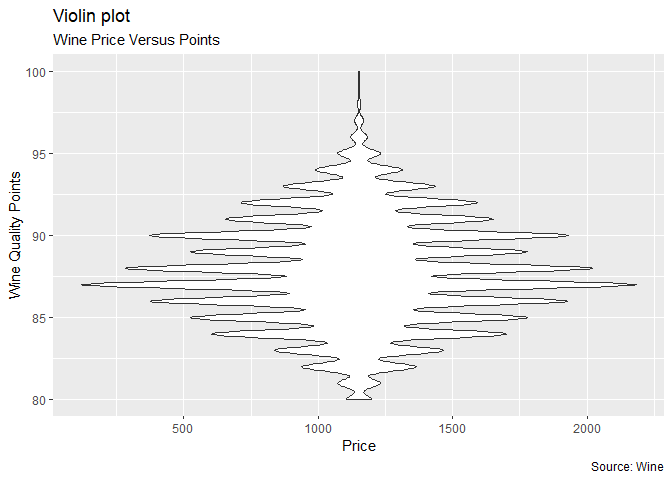

Homework 3
================

Today I wanted to investigate if the price of wine always indicated
higher quality by points. Utilizing the system below a plot was created
to investigate price versus points. This plot indicates that price is
not the sole factor in points in wine as high quality (&gt;90) points
are shown across a variety of price ranges. Further, the highest price
points actually indicate lower quality wines when compared to some of
the lower price points.

95-100 Classic: a great wine. 90-94 Outstanding: a wine of superior
character and style. 85-89 Very good: a wine with special qualities.
80-84 Good: a solid, well-made wine. 75-79 Mediocre: a drinkable wine
that may have minor flaws. 50-74 Not recommended.

``` r
library(tidyverse)
Wine<-read.csv("winemag-data_first150k.csv")
price <- (Wine$price)
points <- (Wine$points)
ggplot(data = Wine, mapping = aes(x = price, y = points)) + geom_point()
```

<!-- -->
